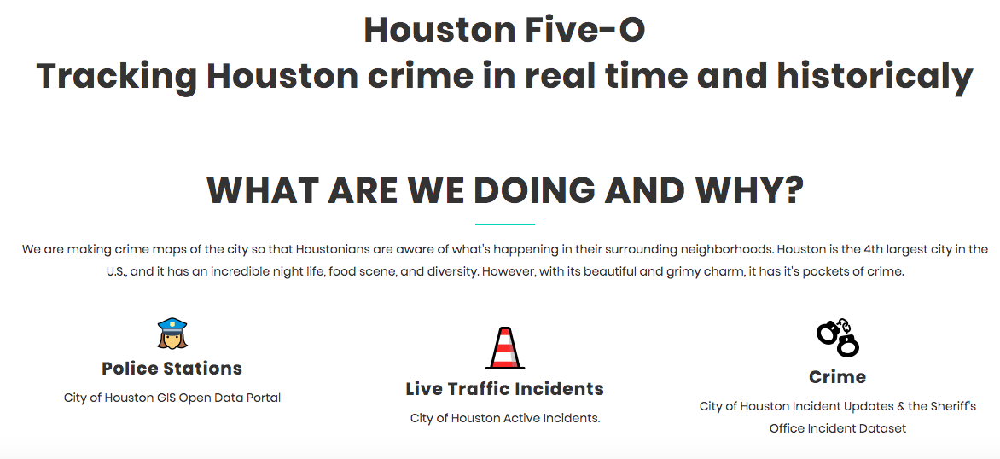
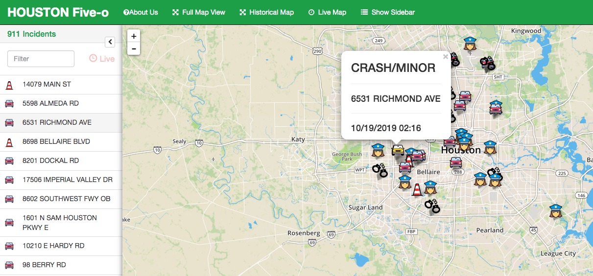
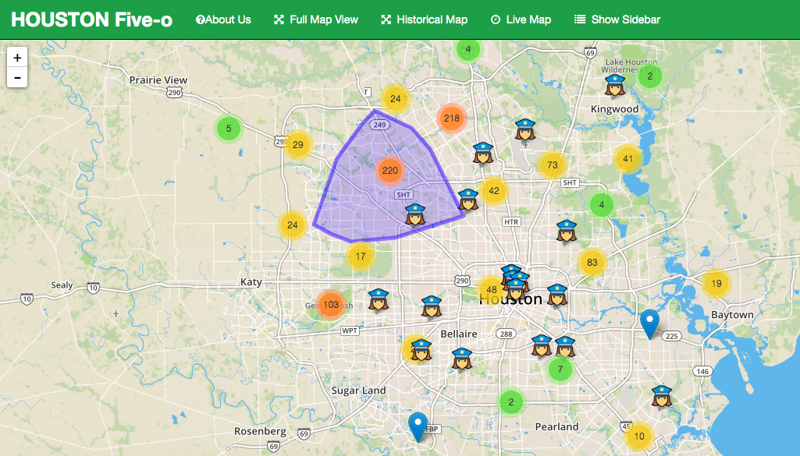

  

APP URL : https://live-crime.herokuapp.com/

**A web application for tracking live and archival data of crime activity in Houston, Texas.**
___

Houston is the fourth largest city in the US, and arguably the best city in Texas. It boasts a booming economy, amazing eateries, fast-paced nightlife and is one of the most culturally diverse populations in the United States. But all this comes with a price. When you live in city like Houston, the population booms, and where there are people there is crime.

Now there is a way to keep up with live and historic incidents of criminal and traffic activity in the Houston area- to help keep you safe and on time, whether you are going to your favorite food truck on Harwin at 2:00 am or searching for the perfect location for your new home or business.

The inspiration for this came about by experiences that we're sure other Houstonians have experienced. The first experience were a series of burglaries in a neighborhood by Sweetwater in the Greenspoint area of Houston, where the homeowners didn't even try to call the police because it takes them too long to show up, if they ever show up. The other experience was a shooting infront of my parent's house where they saw our neighbor's get shot. We know large cities have crime, and crimes usually happen reapetedly in certain areas for variouos reasons, way to many reasons and variables that affect the it to list. So we thought an application to show crime around the city of Houston would be beneficial for people to be aware of what's happending aroudn in the city. 

___

___

**Data**

[HPD Live Incidents](https://cohweb.houstontx.gov/ActiveIncidents/Combined.aspx): 
This site showcases live traffic-related incidents in the city. It is updated on five minute intervals and is populated by Houston Central Command dispatch system.  The data is While the incidents includes data from the police department, fire department and EMS, we relied on the HPD response information only. This info was scrapped from the web.

[CrimeReports/Socata](https://moto.data.socrata.com/dataset/Harris-County-Sheriff-s-Office/p6kq-vsa3):
 This site is run by third party operator Socrata with information provided by the Harris County's Sheriff's Department. It is updated everyday but the data is for the last 24 hours of criminal activity. For this site, we composed a CSV file and also used their API (json) for data.
 
[Houston Police Stations](https://cohgis-mycity.opendata.arcgis.com/datasets/houston-police-stations):
	The City of Houston GIS Open Data Portal, this was fixed information, and we pulled a CSV file of this data. It also provided the station's beats and district information.
  
[Houston PD News Releases](https://www.houstontx.gov/police/news.htm):
	News releases published by the Houston Police Department Public Affairs Division. This data was web-scrapped as well.  
___ 

**Competencies**
* Web Scrapping
* APIs
* CSV
* Leaflet
* Plotly
* Flask
* Heroku
* MongoDB Atlas
* jQuery
* Pandas
* BeautifulSoup4
* Pymongo
* bson

**Overview**

### Our Maps
___ 

#### Live Map

Live map aims to track Real Time 911 incidents reported to Houston Police Department. The incidents are displayed at the co-ordinate of the location they were reported at. The sidebar lists the incidents in ascending order i.e newer incidents on top. On Hover, the map displays a pop-up attached to the incident which highlights the incident and displays addition details such as type, address and time of the reported incident.
___ 

#### Historical Map

The historical Map gathers all reported incidents from past year and displays them as a marker cluster. Clicking the cluster zooms into the map to show individual incidents. We aim to give a picture of various neighbourhoods and the crime activity reported in various areas of Houston.

